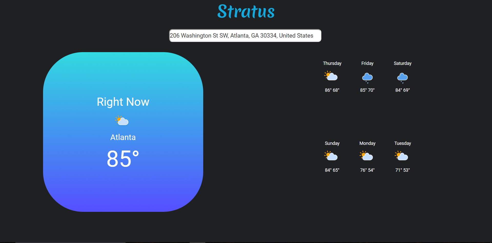

# Stratus

So far I've created a basic weather application that I've so cooly named "Stratus". If you input your location it wil display the current weather 
and the weather for the next 6 days. I used the Darksky API to get the weather information. 

After working with the API I would probably not recommend it for others. As of right now the weather that is displayed just shows the 
"worst" weather for that day. This means that if there is a relatively sunny day but that night its cloudy, the API will tell you that it
will be cloudy for that night. I wish they would seperate the weather into day and night. I know they have plans to change this in the future.
Overall its a good API with tons of interesting weather data and easy to use. 

Things Used
<ul>
<li>AngularJS</li>
<li>Moment.js - parse, validate, manipulate, and display dates and times in JavaScript</li>
<li>Darksky API</li>
<li>amCharts for the animated weather icons</li>
</ul>

The site - http://splendid-basin.surge.sh

